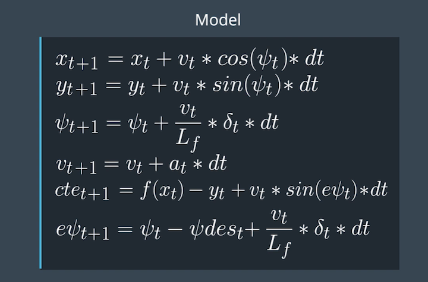

# CarND-Controls-MPC
Self-Driving Car Engineer Nanodegree Program

# Model Predictive Control Project

## Objective
In this project, we have to navigate the car in a simulator by providing steering angle and acceleration values to it. Using a Kinematic model and cost function optimization, we have to make our car follow the trajectory. Cost function is the cross track error which is the distance between car's current position and track waypoints.

## Reflection

Following part discusses the rubric questions and other notes which might be helpful in future. Following steps are used to implement the Model Predictive Controller:
1.  Transform states from Map Coordinate system to Car coordinate system.
2.  Implement the logic of Latency.
3.  Pass state values to the MPC controller.
4.  MPC controller will calculate the cost and return the next states.
5.  Visualize the True Waypoints path (Yellow) and MPC predicted path (Green).

- **The Model**: *Student describes their model in detail. This includes the state, actuators and update equations.*
The kinematic model includes the vehicle's x and y coordinates, vehicle's orientation angle (psi) and velocity, cross-track error and error in psi (epsi). Actuator outputs are steering angle (delta) and acceleration (a). The model combines the state and actuations from the previous timestep to calculate the state for the current timestep based on the equations below:


- **Timestep Length and Elapsed Duration (N & dt)**: *Student discusses the reasoning behind the chosen N (timestep length) and dt (elapsed duration between timesteps) values. Additionally the student details the previous values tried.*
The values chosen for N and dt are 10 and 0.1, respectively which are suggeted in the quiz. These values mean that the optimizer is considering a one-second duration in which to determine a corrective trajectory. Adjusting either N or dt (even by small amounts) often produced erratic behavior. I have tried few other values like N = 20 and dt = 0.05, N = 25 and dt = 0.2, N = 25 and dt = 0.3.

- **Polynomial Fitting and MPC Preprocessing**: *A polynomial is fitted to waypoints. If the student preprocesses waypoints, the vehicle state, and/or actuators prior to the MPC procedure it is described.*
The waypoints are preprocessed by transforming them from Map's coordinate system to the Car's coordinate system. This simplifies the process to fit a polynomial to the waypoints because the vehicle's x and y coordinates are now at the origin (0, 0) and the orientation angle is also zero.

- **Model Predictive Control with Latency**: *The student implements Model Predictive Control that handles a 100 millisecond latency. Student provides details on how they deal with latency.*
I had two options either to implement latency logic before the transformation or after the transformation. I have chosen the second option, to implement latency after transformation. When we do transformation first, we will have accurate values of `new_px` and `new_py` and accurate values of transformed waypoints.
Latency logic is implemented in `main.cpp` between lines (121-126).

### Video Output

[MPC Controller Video](https://github.com/viralzaveri12/CarND-MPC-Project/blob/master/video/mpc_controller.mp4)

## Dependencies

* cmake >= 3.5
 * All OSes: [click here for installation instructions](https://cmake.org/install/)
* make >= 4.1(mac, linux), 3.81(Windows)
  * Linux: make is installed by default on most Linux distros
  * Mac: [install Xcode command line tools to get make](https://developer.apple.com/xcode/features/)
  * Windows: [Click here for installation instructions](http://gnuwin32.sourceforge.net/packages/make.htm)
* gcc/g++ >= 5.4
  * Linux: gcc / g++ is installed by default on most Linux distros
  * Mac: same deal as make - [install Xcode command line tools]((https://developer.apple.com/xcode/features/)
  * Windows: recommend using [MinGW](http://www.mingw.org/)
* [uWebSockets](https://github.com/uWebSockets/uWebSockets)
  * Run either `install-mac.sh` or `install-ubuntu.sh`.
  * If you install from source, checkout to commit `e94b6e1`, i.e.
    ```
    git clone https://github.com/uWebSockets/uWebSockets
    cd uWebSockets
    git checkout e94b6e1
    ```
    Some function signatures have changed in v0.14.x. See [this PR](https://github.com/udacity/CarND-MPC-Project/pull/3) for more details.

* **Ipopt and CppAD:** Please refer to [this document](https://github.com/udacity/CarND-MPC-Project/blob/master/install_Ipopt_CppAD.md) for installation instructions.
* [Eigen](http://eigen.tuxfamily.org/index.php?title=Main_Page). This is already part of the repo so you shouldn't have to worry about it.
* Simulator. You can download these from the [releases tab](https://github.com/udacity/self-driving-car-sim/releases).
* Not a dependency but read the [DATA.md](./DATA.md) for a description of the data sent back from the simulator.


## Basic Build Instructions

1. Clone this repo.
2. Make a build directory: `mkdir build && cd build`
3. Compile: `cmake .. && make`
4. Run it: `./mpc`.

## Code Style

* [Google's C++ style guide](https://google.github.io/styleguide/cppguide.html).